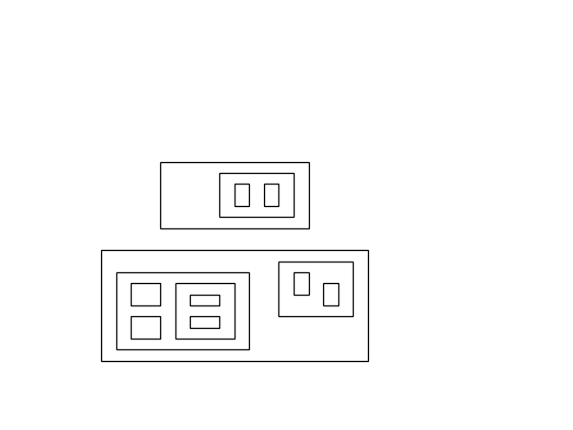

# My solution to the "Land and sea" programming problem
----
When I have first approached this problem I wanted to try a different way of solving it. Instead of going the mathematical-algorithmic way, I decided to use pattern recognition to count the regions. It was an awful idea and I have spent too much time on it (I stopped counting after the first couple of days), but I had a lot of fun and learned a lot :)
----
# How to run the code
`python land_sea.py <path to input file>.txt`

\>\> The solution will be written into the console and multiple new files will be created
# Dependencies
* matplotlib
* numpy
* cv2 (openCV)
---
# Example
input file:
```
14  
1.0 1.0 10.0 6.0  
1.5 1.5 6.0 5.0
2.0 2.0 3.0 3.0
2.0 3.5 3.0 4.5
3.5 2.0 5.5 4.5
4.0 3.5 5.0 4.0
4.0 2.5 5.0 3.0
7.0 3.0 9.5 5.5
7.5 4.0 8.0 5.0
8.5 3.5 9.0 4.5
3.0 7.0 8.0 10.0
5.0 7.5 7.5 9.5
5.5 8.0 6.0 9.0
6.5 8.0 7.0 9.0
```
The rectangles get plotted with `matplotlib` as `generated_plot.png`


Then the "regions" get visualised by different colors and saved as `colorized_plot.png`


The final number of regions gets printed to the console

`$ Number of areas: 14`
----
# TODOS
* Clean up the code and folder structure
* Make a standalone "region counter" script
